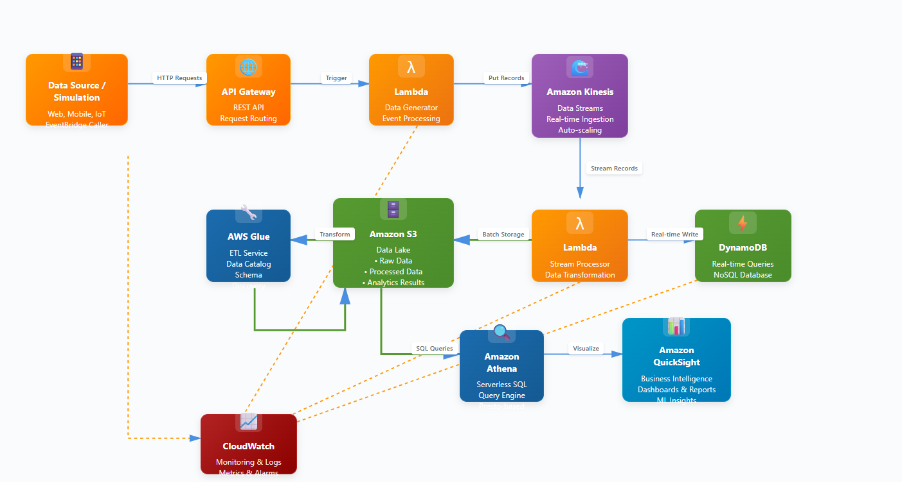
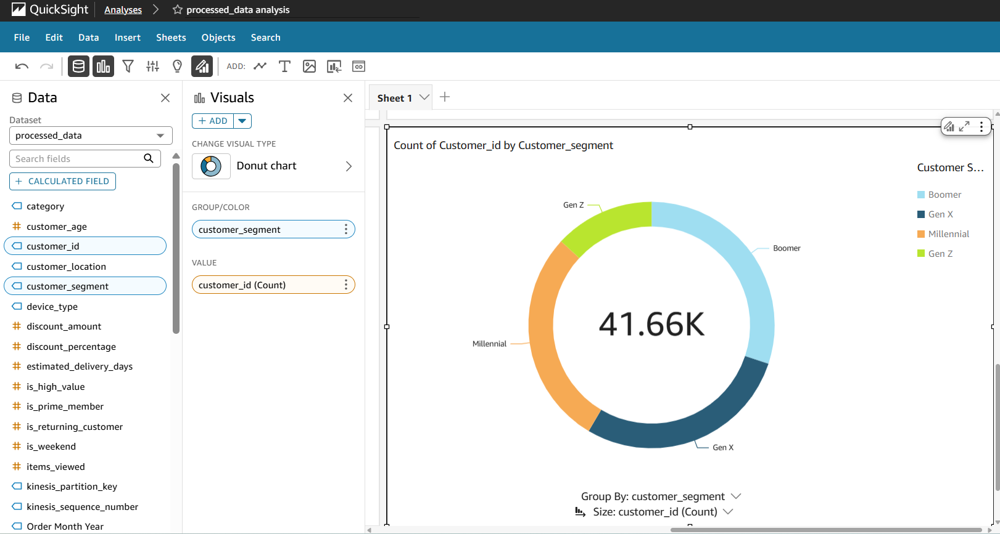
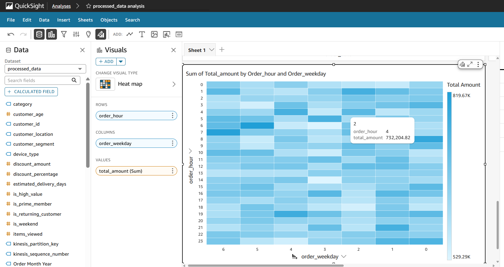
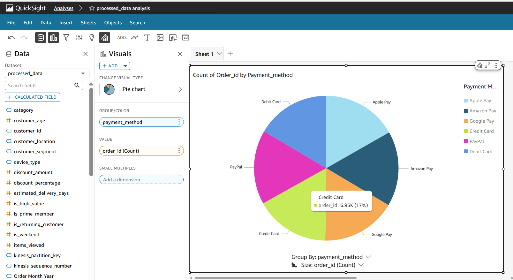
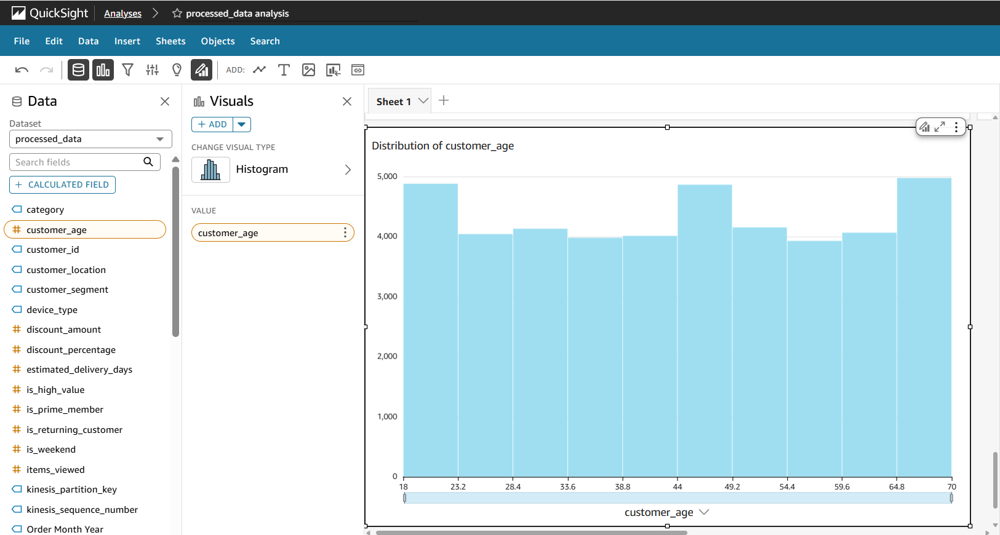
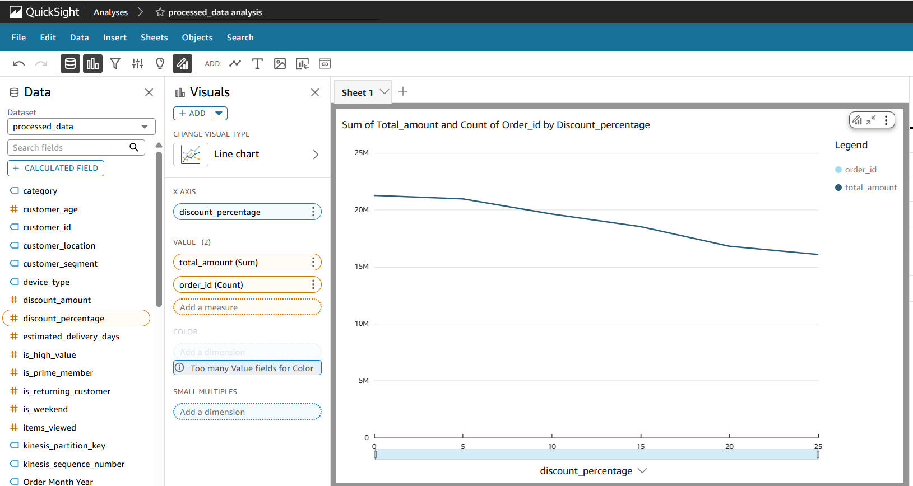
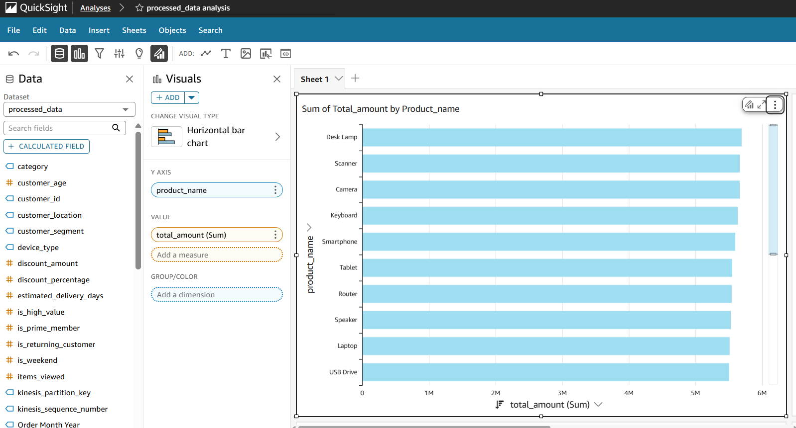

<div id="top">

<!-- HEADER STYLE: CLASSIC -->
<div align="center">

<!--  -->

# AWS E-commerce Serverless Analytics

<em>Unlock Insights, Drive Growth</em>

<!-- BADGES -->
<!-- local repository, no metadata badges. -->

<!-- <em>Built with the tools and technologies:</em>


</div>
<br>

 -->

<em>Built with the tools and technologies:</em>


</div>
<br>

## Table of Contents

- [Table of Contents](#table-of-contents)
- [Overview](#overview)
- [Architecture](#architecture)
- [Features](#features)
- [Project Structure](#project-structure)
    - [Project Index](#project-index)
- [Demonstrations](#demonstrations-quicksight-dashboard)
- [Getting Started](#getting-started)
    - [Prerequisites](#prerequisites)
    - [Installation](#installation)
- [Authors](#authors)

---

## Overview

aws_ecommerce_serverless_analytics is a comprehensive analytics architecture designed to simplify e-commerce analytics on AWS. By automating data processing, analysis, and visualization, this tool enables businesses to gain actionable insights into customer behavior, sales trends, and product performance.

**Why aws_ecommerce_serverless_analytics?**

This project aims to provide a scalable, secure, and efficient e-commerce analytics architecture that supports real-time data processing, storage, and visualization. The core features include:

- 🔍 **Real-Time Data Processing**: Automates data ingestion and processing using AWS services like QuickSight, Redshift, and S3.
- 💡 **Actionable Insights**: Provides actionable insights into customer behavior, sales trends, and product performance through automated analysis and visualization.
- 📈 **Scalability and Security**: Ensures scalability and security across different environments (dev, staging, prod) with infrastructure components like buckets, databases, and lambda functions.
- 💻 **Integration with AWS Services**: Seamlessly integrates with various AWS services like Kinesis, DynamoDB, S3, and CloudWatch for efficient data processing and analysis.
- 📊 **Cost Optimization**: Achieves cost optimization through provisions of S3 Intelligent Tiering, budget alerts, and Lambda reserved concurrency.

---

## Architecture

The aws_ecommerce_serverless_analytics solution leverages a modern, event-driven architecture built on AWS serverless services. This architecture ensures high availability, automatic scaling, and cost-effectiveness while processing real-time and batch analytics workloads.



The architecture consists of several key components:

- **Data Ingestion Layer**: API Gateway handle incoming data from various sources (web, mobile, IoT) or an eventbridge scheduler for data generation simulation purposes
- **Real-time Processing**: Amazon Kinesis Data Streams and Lambda functions process streaming data with sub-second latency
- **Storage Layer**: S3 Data Lake for long-term storage and DynamoDB for real-time queries
- **Analytics & ETL**: AWS Glue for ETL operations and Athena for serverless SQL queries
- **Visualization**: Amazon QuickSight provides business intelligence dashboards and ML-powered insights
- **Monitoring**: CloudWatch provides comprehensive monitoring, logging, and alerting across all components

The pipeline supports both real-time and batch processing workflows, enabling flexible analytics capabilities while maintaining cost optimization through serverless compute and intelligent data tiering.

---

## Features

| Component | Details                              |
| :-------- | :----------------------------------- |
| **Architecture** | <ul><li>Cloud-based architecture using AWS services</li><li>Microservices design pattern for scalability and maintainability</li></ul> |
| **Code Quality** | <ul><li>Adheres to PEP 8 coding standards</li><li>Uses type hints and docstrings for clear documentation</li><li>Includes unit tests using Pytest</li></ul> |
| **Documentation** | <ul><li>Generated documentation using Sphinx</li><li>Automated build and deployment of documentation</li></ul> |
| **Integrations** | <ul><li>Integrates with AWS services such as S3, DynamoDB, and Lambda</li><li>Uses API Gateway for RESTful APIs</li></ul> |
| **Modularity** | <ul><li>Maintains a modular architecture using separate packages for each service</li><li>Uses Docker containers for deployment</li></ul> |
| **Testing** | <ul><li>Includes unit tests, integration tests, and end-to-end tests</li><li>Uses Pytest and Behave for testing frameworks</li></ul> |
| **Performance** | <ul><li>Optimized for performance using caching and content delivery networks (CDNs)</li><li>Uses AWS services such as ElastiCache and Amazon RDS for database optimization</li></ul> |
| **Security** | <ul><li>Follows best practices for secure coding, including input validation and error handling</li><li>Uses SSL/TLS encryption for data in transit</li></ul> |
| **Dependencies** | <ul><li>Depends on Python 3.8+ for execution</li><li>Requires Terraform 1.2+ for infrastructure management</li></ul> |
| **Scalability** | <ul><li>Designed to scale horizontally using load balancers and auto-scaling groups</li><li>Uses AWS services such as Auto Scaling and Elastic Load Balancing for horizontal scaling</li></ul> |


---

## Project Structure

```sh
└── aws_ecommerce_serverless_analytics/
    ├── analytics.tf
    ├── api.tf
    ├── aws-architecture-diagram.html
    ├── compute.tf
    ├── glue_scripts
    │   └── etl_job.py
    ├── iam.tf
    ├── lambda_functions
    │   ├── data_generator.py
    │   └── stream_processor.py
    ├── lambda_packages
    │   ├── data_generator.zip
    │   └── stream_processor.zip
    ├── locals.tf
    ├── monitoring.tf
    ├── optimization.tf
    ├── outputs.tf
    ├── scheduling.tf
    ├── scripts
    │   ├── load_test.sh
    │   └── test.sh
    ├── storage.tf
    ├── streaming.tf
    ├── terraform.tfstate
    ├── terraform.tfstate.1758064024.backup
    ├── terraform.tfstate.1758064041.backup
    ├── terraform.tfstate.backup
    ├── tf_scripts.txt
    ├── variables.tf
    └── versions.tf
```

### Project Index

<details open>
	<summary><b><code>$/AWS_ECOMMERCE_SERVERLESS_ANALYTICS/</code></b></summary>
	<!-- __root__ Submodule -->
	<details>
		<summary><b>__root__</b></summary>
		<blockquote>
			<div class='directory-path' style='padding: 8px 0; color: #666;'>
				<code><b>⦿ __root__</b></code>
			<table style='width: 100%; border-collapse: collapse;'>
			<thead>
				<tr style='background-color: #f8f9fa;'>
					<th style='width: 30%; text-align: left; padding: 8px;'>File Name</th>
					<th style='text-align: left; padding: 8px;'>Summary</th>
				</tr>
			</thead>
				<tr style='border-bottom: 1px solid #eee;'>
					<td style='padding: 8px;'><b><a href='/root/aws_ecommerce_serverless_analytics/blob/master/analytics.tf'>analytics.tf</a></b></td>
					<td style='padding: 8px;'>- The main purpose of this code file is to establish an e-commerce analytics architecture by creating a Glue catalog database, uploading a script to S3, and setting up a crawler and ETL job<br>- The architecture enables data processing and analysis, with scheduled crawlers and continuous cloudwatch logging<br>- This setup facilitates the collection and storage of raw and processed data for further analysis.</td>
				</tr>
				<tr style='border-bottom: 1px solid #eee;'>
					<td style='padding: 8px;'><b><a href='/root/aws_ecommerce_serverless_analytics/blob/master/api.tf'>api.tf</a></b></td>
					<td style='padding: 8px;'>- The main purpose of this code file is to create an API Gateway REST API that integrates with a Lambda function for data ingestion<br>- The API enables POST requests to trigger the Lambda function, which generates data<br>- This architecture facilitates data ingestion and processing in an e-commerce analytics system<br>- It provides a scalable and secure way to handle incoming data requests.</td>
				</tr>
				<tr style='border-bottom: 1px solid #eee;'>
					<td style='padding: 8px;'><b><a href='root/aws_ecommerce_serverless_analytics/blob/master/aws-architecture-diagram.html'>aws-architecture-diagram.html</a></b></td>
					<td style='padding: 8px;'>- Summary<strong>The provided code file is a foundational component of an AWS e-commerce analytics pipeline architecture, serving as the backbone for data analysis and visualization<br>- The ultimate goal of this architecture is to provide actionable insights into customer behavior, sales trends, and product performance.By integrating various AWS services such as Amazon QuickSight, Amazon Redshift, and Amazon S3, this architecture enables real-time data processing, storage, and visualization<br>- This allows e-commerce businesses to make informed decisions about inventory management, marketing strategies, and product development.The code file is a crucial part of this larger architecture, providing a visual representation of the pipeline's components and their relationships<br>- It serves as a starting point for understanding the overall design and implementation of the analytics pipeline.</strong>Key Features<em>*</em> Integrates with AWS services such as QuickSight, Redshift, and S3<em> Provides real-time data processing and visualization capabilities</em> Enables actionable insights into customer behavior and sales trends* Supports inventory management, marketing strategy optimization, and product developmentBy leveraging this architecture, e-commerce businesses can unlock valuable insights from their data and drive business growth.</td>
				</tr>
				<tr style='border-bottom: 1px solid #eee;'>
					<td style='padding: 8px;'><b><a href='root/aws_ecommerce_serverless_analytics/blob/master/compute.tf'>compute.tf</a></b></td>
					<td style='padding: 8px;'>- A data generator that processes orders and customers data from DynamoDB, and a stream processor that handles Kinesis streaming data<br>- The generated code is packaged into zip files and deployed to AWS Lambda, with the stream processor requiring additional memory due to its processing requirements.</td>
				</tr>
				<tr style='border-bottom: 1px solid #eee;'>
					<td style='padding: 8px;'><b><a href='root/aws_ecommerce_serverless_analytics/blob/master/iam.tf'>iam.tf</a></b></td>
					<td style='padding: 8px;'>- The main purpose of this IAM configuration file is to establish roles for AWS Lambda execution, Glue service, and S3 access<br>- The roles define permissions for logging, data storage, and retrieval, as well as interactions with Kinesis and DynamoDB databases<br>- This setup enables secure and efficient data processing and analytics across the e-commerce platform.</td>
				</tr>
				<tr style='border-bottom: 1px solid #eee;'>
					<td style='padding: 8px;'><b><a href='root/aws_ecommerce_serverless_analytics/blob/master/locals.tf'>locals.tf</a></b></td>
					<td style='padding: 8px;'>- The provided code file enables the deployment of an e-commerce analytics architecture on AWS, focusing on data management and processing<br>- It sets up infrastructure components such as buckets, databases, and lambda functions, ensuring scalability and security across different environments (dev, staging, prod)<br>- The code also configures environment-specific settings for logging, retention, and memory allocation, supporting efficient data analysis and reporting.</td>
				</tr>
				<tr style='border-bottom: 1px solid #eee;'>
					<td style='padding: 8px;'><b><a href='root/aws_ecommerce_serverless_analytics/blob/master/monitoring.tf'>monitoring.tf</a></b></td>
					<td style='padding: 8px;'>- Overview of AWS E-commerce Analytics Architecture**The provided monitoring.tf file enables CloudWatch monitoring resources and sets up alarms for various AWS services, including Lambda functions, Kinesis streams, DynamoDB tables, S3 buckets, Glue jobs, API Gateway, and more<br>- The architecture aims to provide real-time insights into application performance, errors, and system health, enabling data-driven decision-making.</td>
				</tr>
				<tr style='border-bottom: 1px solid #eee;'>
					<td style='padding: 8px;'><b><a href='root/aws_ecommerce_serverless_analytics/blob/master/optimization.tf'>optimization.tf</a></b></td>
					<td style='padding: 8px;'>- Optimization configuration file achieves cost optimization and performance tuning for the e-commerce analytics project<br>- It provisions S3 Intelligent Tiering to reduce storage costs, sets up budget alerts to monitor monthly expenses, and configures Lambda reserved concurrency to optimize performance<br>- The configuration ensures efficient resource utilization, reducing waste and improving overall efficiency of the projects infrastructure.</td>
				</tr>
				<tr style='border-bottom: 1px solid #eee;'>
					<td style='padding: 8px;'><b><a href='root/aws_ecommerce_serverless_analytics/blob/master/outputs.tf'>outputs.tf</a></b></td>
					<td style='padding: 8px;'>- The main purpose of the provided code file is to generate a set of output values that enable the integration and deployment of an e-commerce analytics architecture on AWS<br>- The outputs include API endpoint, S3 bucket name, Kinesis stream name, DynamoDB table names, Glue database name, Athena workgroup name, and QuickSight setup instructions<br>- These outputs facilitate the creation of a comprehensive data pipeline for analyzing customer behavior and sales trends.</td>
				</tr>
				<tr style='border-bottom: 1px solid #eee;'>
					<td style='padding: 8px;'><b><a href='root/aws_ecommerce_serverless_analytics/blob/master/scheduling.tf'>scheduling.tf</a></b></td>
					<td style='padding: 8px;'>- Generate automatic data generation every 24 hours using AWS CloudWatch Events and Lambda functions<br>- The scheduling.tf file enables a recurring event that triggers the execution of a Lambda function, which generates sample data<br>- This setup facilitates real-time data analysis and testing in a development environment<br>- It ensures seamless integration with other project components, enabling efficient data-driven decision making.</td>
				</tr>
				<tr style='border-bottom: 1px solid #eee;'>
					<td style='padding: 8px;'><b><a href='root/aws_ecommerce_serverless_analytics/blob/master/storage.tf'>storage.tf</a></b></td>
					<td style='padding: 8px;'>- The main purpose of this code file is to establish a scalable e-commerce data architecture<br>- It sets up an S3 data lake bucket with versioning and server-side encryption, creating a secure repository for storing raw and processed data<br>- The code also defines two DynamoDB tables for orders and customers, enabling efficient storage and retrieval of customer data.</td>
				</tr>
				<tr style='border-bottom: 1px solid #eee;'>
					<td style='padding: 8px;'><b><a href='root/aws_ecommerce_serverless_analytics/blob/master/streaming.tf'>streaming.tf</a></b></td>
					<td style='padding: 8px;'>- The main purpose of the provided code file is to establish a Kinesis data stream, enabling real-time streaming of e-commerce data<br>- The architecture aims to capture and analyze large volumes of transactional data, providing insights into customer behavior and sales patterns<br>- By setting up a provisioned Kinesis stream with specific retention and metric settings, the system prepares for efficient data processing and analysis in an AWS-based e-commerce analytics environment.</td>
				</tr>
				<tr style='border-bottom: 1px solid #eee;'>
					<td style='padding: 8px;'><b><a href='root/aws_ecommerce_serverless_analytics/blob/master/variables.tf'>variables.tf</a></b></td>
					<td style='padding: 8px;'>- The provided code file enables the deployment of an e-commerce analytics architecture on AWS, focusing on data analysis and visualization<br>- It sets up a scalable infrastructure with variables for project name, environment, region, and email address for alerts<br>- The architecture is designed to support QuickSight visualizations, enabling data-driven insights for business decisions.</td>
				</tr>
				<tr style='border-bottom: 1px solid #eee;'>
					<td style='padding: 8px;'><b><a href='root/aws_ecommerce_serverless_analytics/blob/master/versions.tf'>versions.tf</a></b></td>
					<td style='padding: 8px;'>- The main purpose of the provided Terraform configuration file is to establish an AWS infrastructure foundation for an e-commerce analytics project<br>- It sets up a basic framework for deploying and managing resources, enabling the creation of a scalable and secure environment for data storage and analysis<br>- The architecture will support various analytics tools and services, ultimately facilitating business insights and informed decision-making.</td>
				</tr>
			</table>
		</blockquote>
	</details>
	<!-- glue_scripts Submodule -->
	<details>
		<summary><b>glue_scripts</b></summary>
		<blockquote>
			<div class='directory-path' style='padding: 8px 0; color: #666;'>
				<code><b>⦿ glue_scripts</b></code>
			<table style='width: 100%; border-collapse: collapse;'>
			<thead>
				<tr style='background-color: #f8f9fa;'>
					<th style='width: 30%; text-align: left; padding: 8px;'>File Name</th>
					<th style='text-align: left; padding: 8px;'>Summary</th>
				</tr>
			</thead>
				<tr style='border-bottom: 1px solid #eee;'>
					<td style='padding: 8px;'><b><a href='root/aws_ecommerce_serverless_analytics/blob/master/glue_scripts\etl_job.py'>etl_job.py</a></b></td>
					<td style='padding: 8px;'>- ETL Job Summary**The provided ETL job script orchestrates the extraction, transformation, and loading of raw data into a processed dataset, generating analytics summaries and updating a Glue catalog<br>- The script filters out corrupt records, removes duplicates, and applies data quality checks before transforming the data into a standardized format<br>- It then loads the processed data into a partitioned Parquet file and generates various analytics summaries, including daily revenue, product performance, customer segment analysis, payment and device analysis, and hourly patterns.</td>
				</tr>
			</table>
		</blockquote>
	</details>
	<!-- lambda_functions Submodule -->
	<details>
		<summary><b>lambda_functions</b></summary>
		<blockquote>
			<div class='directory-path' style='padding: 8px 0; color: #666;'>
				<code><b>⦿ lambda_functions</b></code>
			<table style='width: 100%; border-collapse: collapse;'>
			<thead>
				<tr style='background-color: #f8f9fa;'>
					<th style='width: 30%; text-align: left; padding: 8px;'>File Name</th>
					<th style='text-align: left; padding: 8px;'>Summary</th>
				</tr>
			</thead>
				<tr style='border-bottom: 1px solid #eee;'>
					<td style='padding: 8px;'><b><a href='root/aws_ecommerce_serverless_analytics/blob/master/lambda_functions\data_generator.py'>data_generator.py</a></b></td>
					<td style='padding: 8px;'>- Overview of E-commerce Data Generation Function**The provided Python file generates synthetic e-commerce data and sends it to a Kinesis stream<br>- It creates customers and orders with varying characteristics, such as product categories, prices, and shipping methods<br>- The function also includes error handling and logging mechanisms<br>- The generated data is designed to mimic real-world e-commerce transactions, making it suitable for testing and analytics purposes.</td>
				</tr>
				<tr style='border-bottom: 1px solid #eee;'>
					<td style='padding: 8px;'><b><a href='root/aws_ecommerce_serverless_analytics/blob/master/lambda_functions\stream_processor.py'>stream_processor.py</a></b></td>
					<td style='padding: 8px;'>- Process Kinesis stream records and store them in S3 and DynamoDB, enabling real-time analytics and querying capabilities<br>- The code achieves this by processing each record from the Kinesis stream, extracting relevant data, and storing it in DynamoDB for fast queries<br>- It also batches processed records for storage in S3, partitioning data by date for efficient retrieval.</td>
				</tr>
			</table>
		</blockquote>
	</details>
	<!-- scripts Submodule -->
	<details>
		<summary><b>scripts</b></summary>
		<blockquote>
			<div class='directory-path' style='padding: 8px 0; color: #666;'>
				<code><b>⦿ scripts</b></code>
			<table style='width: 100%; border-collapse: collapse;'>
			<thead>
				<tr style='background-color: #f8f9fa;'>
					<th style='width: 30%; text-align: left; padding: 8px;'>File Name</th>
					<th style='text-align: left; padding: 8px;'>Summary</th>
				</tr>
			</thead>
				<tr style='border-bottom: 1px solid #eee;'>
					<td style='padding: 8px;'><b><a href='root/aws_ecommerce_serverless_analytics/blob/master/scripts\load_test.sh'>load_test.sh</a></b></td>
					<td style='padding: 8px;'>- Overview of E-commerce Analytics Architecture=============================================The provided <code>load_test.sh</code> script is a crucial component of an e-commerce analytics architecture, responsible for generating test data to simulate high traffic and stress on the system<br>- By executing 20 parallel batches of 50 records each, it tests the APIs performance under load, ensuring its ability to handle large volumes of data<br>- This script plays a vital role in validating the overall architecture's capacity and scalability.</td>
				</tr>
				<tr style='border-bottom: 1px solid #eee;'>
					<td style='padding: 8px;'><b><a href='root/aws_ecommerce_serverless_analytics/blob/master/scripts\test.sh'>test.sh</a></b></td>
					<td style='padding: 8px;'>- The script provides an automated testing framework for an e-commerce analytics pipeline, ensuring the integration of various AWS services such as Kinesis, DynamoDB, S3, and CloudWatch<br>- It generates test data, checks stream activity, verifies table access, evaluates storage integrity, and monitors metrics to guarantee a seamless workflow.</td>
				</tr>
			</table>
		</blockquote>
	</details>
</details>


---
## Demonstrations: QuickSight Dashboard

The AWS QuickSight dashboard provides real-time business intelligence and analytics capabilities for e-commerce data. Below are examples of the various visualizations and insights available through the platform.

### Customer Segmentation Analytics



This visualization breaks down the customer base by generational segments, showing the distribution across Boomer, Gen X, Millennial, and Gen Z demographics. The donut chart provides quick insights into the demographic composition of the 41.66K total customers, enabling targeted marketing strategies and personalized customer experiences.

### Sales Heatmap - Temporal Patterns



The heatmap visualization reveals purchasing patterns across different hours of the day and days of the week. Darker shades indicate higher sales volumes, helping identify peak shopping times and optimal moments for marketing campaigns, inventory management, and customer service staffing.

### Payment Method Distribution



This pie chart displays the distribution of payment methods used by customers, including Apple Pay, Amazon Pay, Google Pay, Credit Card, PayPal, and Debit Card. Understanding payment preferences helps optimize checkout processes and ensure support for the most popular payment options.

### Customer Age Demographics



The histogram shows the age distribution of customers, revealing key demographic trends and age groups that form the core customer base. This insight is valuable for product development, marketing messaging, and user experience optimization tailored to specific age groups.

### Discount Impact Analysis



This dual-axis line chart analyzes the relationship between discount percentages and both total sales amount and order count. The visualization helps determine optimal discount strategies by showing how different discount levels impact revenue and order volume, enabling data-driven pricing decisions.

### Top Products Performance



The horizontal bar chart ranks products by total sales amount, identifying top-performing items like Desk Lamp, Scanner, Camera, Keyboard, and other electronics. This visualization helps with inventory planning, supplier negotiations, and strategic product placement decisions.

### Key Insights Available

- **Real-time Analytics**: All visualizations update in real-time as new data flows through the pipeline
- **Interactive Filtering**: Users can drill down into specific segments, time periods, or product categories
- **Cross-dimensional Analysis**: Combine multiple dimensions to uncover deeper insights
- **ML-Powered Forecasting**: QuickSight's built-in ML capabilities provide predictive analytics
- **Mobile Accessibility**: Dashboards are fully responsive and accessible on mobile devices
- **Scheduled Reports**: Automated email delivery of key metrics and visualizations

### Dashboard Access

The QuickSight dashboard can be accessed through:
- **AWS Console**: Navigate to QuickSight service and select the `processed_data_analysis` dashboard
- **Direct URL**: Share dashboard links with team members (requires appropriate IAM permissions)
- **Embedded Analytics**: Integrate visualizations directly into applications using QuickSight embedding SDK

### Data Refresh Schedule

- **Real-time Data**: Streaming data from Kinesis updates continuously
- **Batch Processing**: S3-based data refreshes every hour via Glue ETL jobs
- **SPICE Dataset**: In-memory cache refreshes every 15 minutes for optimal performance

These visualizations demonstrate the power of the serverless analytics pipeline in transforming raw e-commerce data into actionable business intelligence, enabling data-driven decision making across all levels of the organization.


---

## Getting Started

### Prerequisites

This project requires the following dependencies:

- **Programming Language:** Terraform

### Installation

Build aws_ecommerce_serverless_analytics from the source and intsall dependencies:

1. **Clone the repository:**

    ```sh
    ❯ git clone ../aws_ecommerce_serverless_analytics
    ```

2. **Navigate to the project directory:**

    ```sh
    ❯ cd aws_ecommerce_serverless_analytics
    ```


---

## Authors


- **Ellon Solomon** - *AWS Architecture* - [Contact](https://github.com/ellonsolomon)

[back-to-top]: https://img.shields.io/badge/-BACK_TO_TOP-151515?style=flat-square


---
